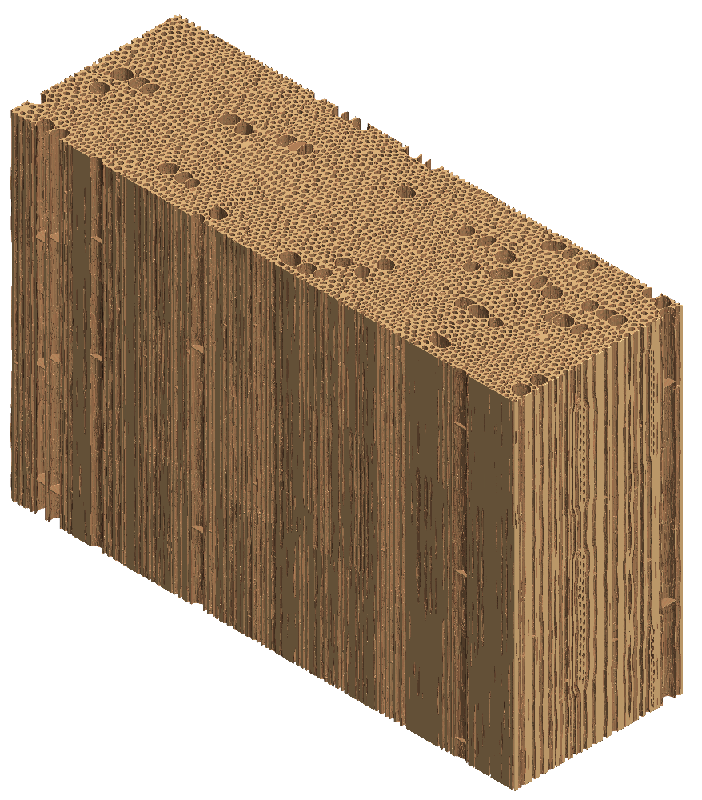

# High-density Wood Fiber Network
Author: Bin Chen

KTH Royal Institute of Technology, Sweden

E-mail 📧: binchen@kth.se or cbbuaa@outlook.com

## Project summary
This project aims to study the optical scattering of transparent composites using ray tracing. We specifically used it to numerically study the optical scattering property of transparent wood and wood fiber network materials. The key assumption is that the feature size is at least in the order of micrometers. Therefore, the geometrical optics can be used. This optical scattering is assumed from only the refractive index difference between the matrix and the fiber. One unique advantage is that, no mesh of the 3D microstructure model is required, which is very helpful for complex microstructure, such as wood and fiber networks.

The project can be easily adapted to 2D. Therefore, we can generate a large dataset for optical scattering easily, which can then be used to train the deep learning model.

You can find the open-source sister program to generate 3D microstructural models of [wood](https://github.com/BinChenOPEN/Wood-Microstructure-Modeling) and [high-density wood fiber networks](https://github.com/BinChenOPEN/3D-High-Density-Wood-Fiber-Network-Model) in the same account. 

## 📔 Log
**2025/11/14:**

The software was confirmed to work on Windows 11, MATLAB 2024b.

## Key information
### Usage
After setting the parameters in ``Main.m``, run ``Main.m``.
### Input Parameters
Several ``input parameters`` need to be set in ``Main.m``.
   - ``MATERIAL``, indicate which type of materials will we study. We can choose between between 'TW' (Transparent wood) and 'WFN' (Wood Fiber Network);
   - ``folder``, the folder where the 3D microstructural models are saved;
   - ``folder_save``, the folder where we want to save the results to;
   - ``RawImg_File``, the name of the 3D microstructural image, and it should be binary image;
   - ``RawImg``, the 3D volume of the microstructural model. Make sure ``RawImg`` with value only 1 and 0. In the volume, the ray will propagate inside the image in the ``XZ`` plane and propagate along ``Y`` axis, where ``X``, ``Y``, ``Z`` are the ``1st``, ``2nd``, and ``3rd`` dimension of the volume;
   - ``step_SCALE``, an important parameter. The ray propagates forwards step by step. This value determine the step size. You can choose it between 1 and 2. Choose 1 when the feature size is small, while 2 for slightly larger features;
   - ``n_Fiber`` and ``n_Matrix``, the refractive index (RI) of the two compositions in the volumes. ``n_Fiber`` indicate the RI of the composition with voxel grey value of 1, while ``n_Matrix`` for grey value of 0;
   - ``num_Ray``, how many rays you want to trace through the volume. The default value is ``1000``;
   - ``RandomRegionSize``, The incident rays are generated perpendicularly in a square region with edge length of ``RandomRegionSize`` on one surface (``XZ`` plane) of the sample.
   - ``save_gif``, choose do you want to save the ``.gif`` animation file for the ray path in the 3D space.

### Output Parameters
  All the data are saved in ``Params.mat``.
  - ``Params.num_TotRef_all``, event number of the total reflection for each ray;
  - ``Params.Haze_x``, the haze along x direction;
  - ``Params.Haze_z``, the haze along z direction;
  - ``Params.Angle_x`` the angle of the emergent rays along x direction;
  - ``Params.Angle_z``  the angle of the emergent rays along z direction;
  - ``Params.n_refall``, the directional vector of the emergent rays;
 

***
## Results
### Numerical simulation of the optical scattering through transparent composites using ray tracing.

We provide several examples (see the folders), including ``Transparent Wood``, ``High-density Wood Fiber Network``:
  - ``Sample_pi_16``, the High-density WFN with the standard deviation of the fiber orientation of $\pi/16$;
  - ``Sample_pi_32``, the High-density WFN with the standard deviation of the fiber orientation of $\pi/32$;
  - ``Sample_random``, the High-density WFN with the fibers being randomly distributed.
  - ``TW``, the transparent wood microstructure with size of 3000 $\times$ 1000 $\times$ 2000 voxels.

We present the result for TW below.

  

 Figure 1. 3D TW wood microstructure.

  

 Figure 2. The 3D ray paths of 1000 rays traveling through the 3D TW wood microstructure. The refractive index difference is set to 0.02

## Questions & Suggestions
Please contact Bin Chen (binchen@kth.se), if you want to contribute code/algorithms to this project, or have question or suggestion. 

## Citation
Anyone who uses the code please cite: **[Chen, Bin, Sergei Popov, and Lars A. Berglund. "Ray scattering in fiber-reinforced transparent wood composites–wood microstructural effects and virtual camera simulation." Optical Materials 162 (2025): 116953.](https://www.sciencedirect.com/science/article/pii/S0925346725003131)** If you need to redistribute the software, please keep the original author information.
